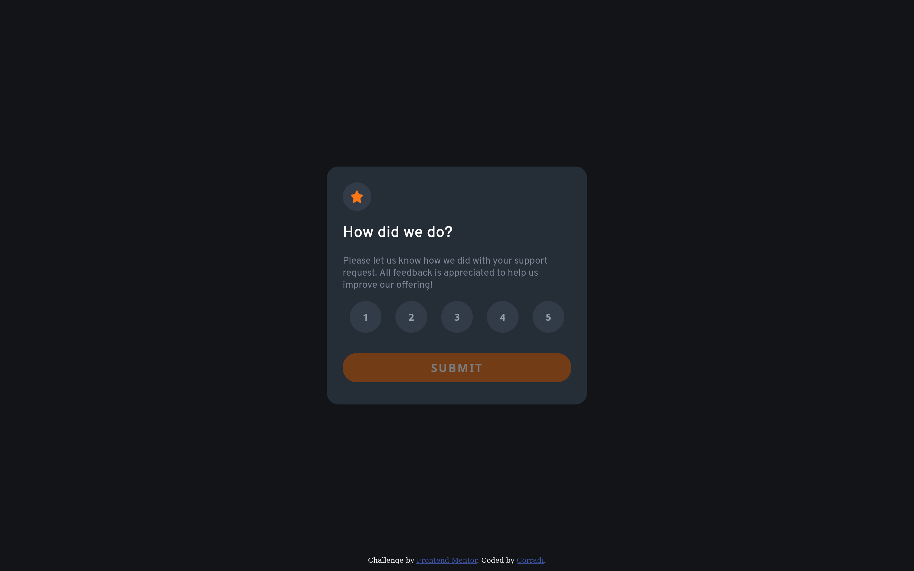

# Frontend Mentor - Interactive rating component solution

This is a solution to the [Interactive rating component challenge on Frontend Mentor](https://www.frontendmentor.io/challenges/interactive-rating-component-koxpeBUmI). Frontend Mentor challenges help you improve your coding skills by building realistic projects. 

## Screenshot

[Live site here](https://corradivm.github.io/frontend-mentor-challenges/interactive-rating-component)

## Built with

- Semantic HTML5 markup
- CSS custom properties
- Flexbox
- JavaScript

## Author

- Frontend Mentor - [@Corradivm](https://www.frontendmentor.io/profile/Corradivm)