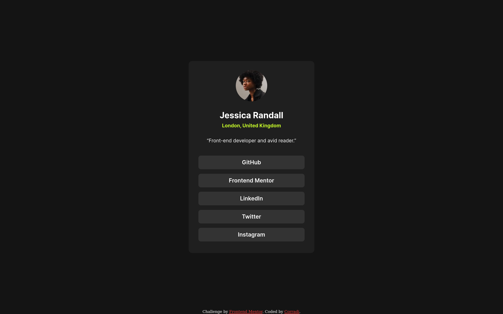

# Frontend Mentor - Social links profile solution

This is a solution to the [Social links profile challenge on Frontend Mentor](https://www.frontendmentor.io/challenges/social-links-profile-UG32l9m6dQ). Frontend Mentor challenges help you improve your coding skills by building realistic projects. 

## Screenshot

[Live site here](https://corradivm.github.io/frontend-mentor-challenges/social-links-profile)

## Built with

- Semantic HTML5 markup
- CSS custom properties
- Flexbox

## Author

Frontend Mentor - [@Corradi](https://www.frontendmentor.io/profile/Corradivm)
